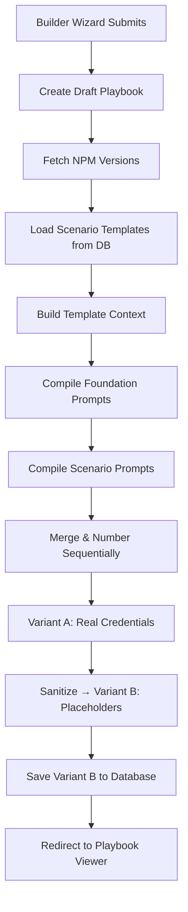

# Compilation Engine

The compilation engine is the core of the Segment Demo Builder. It takes your wizard configuration and produces a sequenced set of AI prompts that Claude Code can execute to build a complete demo application.

## Compilation Pipeline



## Two Prompt Sources

The compiler draws prompts from two sources:

<Tabs>
  <Tab title="Foundation Prompts (Code)">
    Generated by functions in the compiler source code. These are too complex for simple template substitution and contain conditional logic:

    1. **Scaffold & Dependencies** — Creates the Next.js project, installs all NPM packages with exact versions, initializes shadcn/ui
    2. **Environment Setup** — Writes `.env.local`, creates the Analytics Provider, Supabase client, and wraps the root layout
    3. **Architecture Setup** — Conditionally builds features based on your wizard selections (SE Sidebar, Seeded Profiles, Profile API, Intent Predictions, Second-Page Personalization)
  </Tab>
  <Tab title="Scenario Prompts (Database)">
    Stored as `prompt_templates` rows in the database. Each template contains `{{VARIABLE}}` placeholders that are substituted at compile time:

    - Templates are linked to `demo_features` entries via `prompt_template_id`
    - Only templates for scenarios you selected in Step 3 are compiled
    - Admins can edit templates via the [Prompt Template Editor](/admin/prompt-template-editor)
  </Tab>
</Tabs>

## Template Variable Substitution

The template engine replaces `{{VARIABLE_NAME}}` placeholders with values from your configuration:

```typescript
// Example template content
"Welcome to {{CUSTOMER_NAME}}! Using Segment write key {{SEGMENT_WRITE_KEY}}..."

// After substitution
"Welcome to Acme Corp! Using Segment write key wk_abc123..."
```

The engine builds a flat context object from your wizard input:

| Variable Category | Examples |
|-------------------|----------|
| **Context** | `CUSTOMER_NAME`, `INDUSTRY` |
| **Credentials** | `SEGMENT_WRITE_KEY`, `SUPABASE_URL`, etc. |
| **NPM Versions** | `NPM_NEXT_VERSION`, `NPM_REACT_VERSION`, etc. |

Empty credential fields automatically become placeholder values (e.g., `YOUR_SEGMENT_WRITE_KEY`).

See the complete [Template Variables Reference](/reference/templates/variables) for all 17 supported variables.

## NPM Version Resolution

Instead of hardcoding dependency versions (which leads to demo rot), the compiler fetches the latest stable versions from the NPM registry at compile time:

```
GET /api/dependencies/versions
```

**Target packages:**

| Package | Fallback Version |
|---------|-----------------|
| `next` | 16.2.3 |
| `react` | 19.2.4 |
| `react-dom` | 19.2.4 |
| `tailwindcss` | 4.0.0 |
| `framer-motion` | 12.38.0 |
| `@segment/analytics-next` | 1.76.0 |
| `@supabase/supabase-js` | 2.103.0 |
| `lucide-react` | 1.8.0 |
| `@supabase/ssr` | 0.10.2 |

If the NPM registry is unreachable, the compiler falls back to these hardcoded versions. The API endpoint is rate-limited (100 requests per 10 minutes) and ISR-cached for 1 hour.

## Sanitization

After compilation, the sanitizer creates a safe copy of the prompts by replacing real credential values with placeholders:

| Credential Field | Placeholder |
|-----------------|-------------|
| `segmentWriteFrontend` | `YOUR_SEGMENT_WRITE_KEY` |
| `segmentWriteBackend` | `YOUR_SEGMENT_BACKEND_WRITE_KEY` |
| `segmentWorkspace` | `YOUR_SEGMENT_WORKSPACE_TOKEN` |
| `segmentProfileToken` | `YOUR_SEGMENT_PROFILE_TOKEN` |
| `supabaseUrl` | `YOUR_SUPABASE_URL` |
| `supabaseAnon` | `YOUR_SUPABASE_ANON_KEY` |

The sanitized version (Variant B) is what gets saved to the database. The original version with real keys (Variant A) stays in the browser's Zustand store for immediate use.

## Compilation Stages UI

During compilation, the user sees a progress indicator moving through four stages:

1. **Loading** — Fetching NPM versions from the API
2. **Compiling** — Building and merging prompts with template substitution
3. **Saving** — PATCHing the playbook with sanitized prompts
4. **Redirecting** — Navigating to the Playbook Viewer
