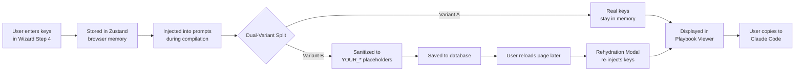

# Credential Security

The Segment Demo Builder's most critical design constraint is that **API keys and tokens are never persisted to the database**. This page explains why and how.

## Why Credentials Stay In-Memory

Demo playbooks are designed to be saved, shared, and revisited. If real Segment Write Keys or Supabase tokens were stored in the database, they could be exposed through:

- Database backups or exports
- Public share links
- Admin access to the database
- Potential security breaches

Instead, credentials exist only in browser memory during your active session.

## Credential Lifecycle



## Zustand Persistence Layer

The Builder Wizard uses Zustand with localStorage persistence, but credentials are **explicitly excluded** from persistence:

```typescript
partialize: (state) => ({
  currentStep: state.currentStep,
  customerName: state.customerName,
  industry: state.industry,
  persona: state.persona,
  architecture: state.architecture,
  selectedScenarios: state.selectedScenarios,
  // keys is intentionally excluded — credentials stay in-memory only
}),
```

This means:
- Context, architecture, and scenario selections **survive** page refreshes and browser restarts
- Credentials are **cleared** on any page refresh, tab close, or session end

## The Sanitization Map

During compilation, the sanitizer replaces real values with deterministic placeholders:

| Store Key | Placeholder |
|-----------|-------------|
| `segmentWriteFrontend` | `YOUR_SEGMENT_WRITE_KEY` |
| `segmentWriteBackend` | `YOUR_SEGMENT_BACKEND_WRITE_KEY` |
| `segmentWorkspace` | `YOUR_SEGMENT_WORKSPACE_TOKEN` |
| `segmentProfileToken` | `YOUR_SEGMENT_PROFILE_TOKEN` |
| `supabaseUrl` | `YOUR_SUPABASE_URL` |
| `supabaseAnon` | `YOUR_SUPABASE_ANON_KEY` |

The sanitizer deep-clones the prompt array and performs a global string replacement for each credential that has a non-empty value.

## Rehydration

When you load a saved playbook, the viewer detects placeholder strings in the prompt text. If any are found, the **Rehydration Modal** appears, allowing you to re-enter your credentials:

1. The modal presents input fields for all 6 credential types
2. You paste your real keys
3. The viewer performs an in-memory replacement of `YOUR_*` placeholders with the real values
4. The updated prompts are displayed — but **never re-saved** to the database

You can also skip rehydration if you just want to review the playbook structure without real credentials.

<Warning>
  Rehydration is a client-side operation only. The database always retains the sanitized version, regardless of how many times you rehydrate.
</Warning>

## Sharing Implications

When you share a playbook via the `/share/[playbook_id]` URL:

- The recipient sees the **sanitized version** (Variant B) with `YOUR_*` placeholders
- They cannot access your real credentials
- The share page does not offer a rehydration modal — it's read-only
- RLS enforces that only `completed` playbooks are accessible via the share route
