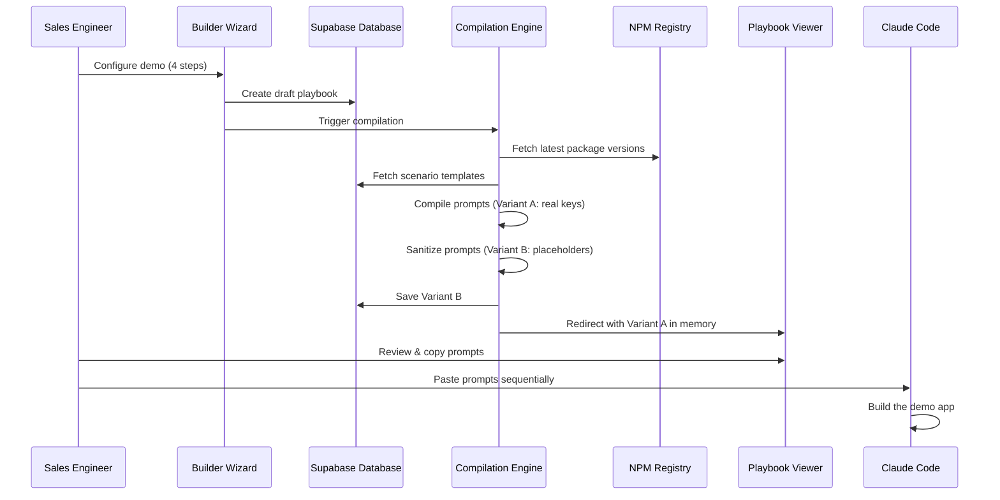

# How It Works

The Segment Demo Builder follows a linear pipeline: **Configure → Compile → View → Build**. Each stage feeds the next, producing a set of sequenced AI prompts that Claude Code executes to build a fully working Segment CDP demo.

## The Pipeline

## Four Stages

<Steps>
  <Step title="Configure">
    The [Builder Wizard](/guides/builder-wizard) collects four categories of input:

    1. **Context** — Customer name, target persona, industry vertical
    2. **Architecture** — Optional features like SE Sidebar, Seeded Profiles, Profile API
    3. **Scenarios** — Industry-specific personalization use cases from the database
    4. **Credentials** — Segment and Supabase API keys (held in memory only)

    On submission, a draft playbook row is created in the database with status `draft`.
  </Step>

  <Step title="Compile">
    The [Compilation Engine](/concepts/compilation) runs four sub-phases:

    1. **Version Resolution** — Fetches latest stable NPM versions for all target packages
    2. **Template Loading** — Retrieves scenario prompt templates from the database
    3. **Prompt Assembly** — Merges foundation prompts (from code) with scenario prompts (from DB), substituting `{{VARIABLE}}` placeholders with real values
    4. **Sanitization** — Deep-clones the prompts, replacing real credentials with `YOUR_*` placeholders, and saves this sanitized version to the database
  </Step>

  <Step title="View">
    The [Playbook Viewer](/guides/playbook-viewer) presents the compiled prompts as a step-by-step guide:

    - Each prompt is displayed as a numbered card with a title, the prompt text, and expected output
    - A progress stepper tracks which steps you've completed
    - Placeholder detection triggers the [Rehydration Modal](/tutorials/rehydrate-playbook) to re-inject credentials
    - The **SE Demo Script** tab provides a presentation narrative
  </Step>

  <Step title="Build">
    Copy each prompt into Claude Code in sequence:

    1. **Scaffold & Dependencies** — Creates the Next.js project with all packages
    2. **Environment Setup** — Configures Segment SDK, Supabase client, and providers
    3. **Architecture** — Builds optional features (SE Sidebar, Seeded Profiles, etc.)
    4. **Scenarios** — Implements each selected personalization use case

    Each step builds on the previous one. Follow the order exactly.
  </Step>
</Steps>

## The Dual-Variant System

A key architectural decision is the **two-variant compilation model**:

<Tabs>
  <Tab title="Variant A (In-Memory)">
    Contains your **real credentials** — actual Segment Write Keys, API tokens, and Supabase keys embedded directly in the prompt text. This variant:
    - Lives only in browser memory (Zustand store)
    - Is what you copy into Claude Code
    - Is never sent to or stored in the database
  </Tab>
  <Tab title="Variant B (Persisted)">
    Contains **sanitized placeholders** like `YOUR_SEGMENT_WRITE_KEY` in place of real values. This variant:
    - Is saved to the database in the `generated_prompts` column
    - Is what appears when you reload the playbook later
    - Is safe to share via public links
    - Can be rehydrated with real keys via the Rehydration Modal
  </Tab>
</Tabs>

This design ensures that credentials are never at rest in the database while still allowing playbooks to be saved, shared, and revisited.
