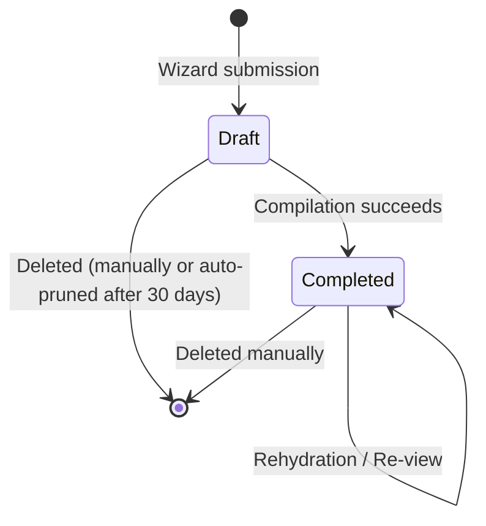

# Playbooks

A **playbook** is the central artifact of the Segment Demo Builder. It represents a complete, compiled set of AI build prompts tailored to a specific customer demo. Each playbook captures the demo configuration and the generated prompts needed to build the demo application.

## Playbook Lifecycle



A playbook has two possible statuses:

| Status | Meaning |
|--------|---------|
| `draft` | Created by the wizard but not yet compiled. Stale drafts are auto-pruned after 30 days. |
| `completed` | Compilation succeeded. Prompts are available in the viewer. Can be shared publicly. |

## What's Inside a Playbook

Each playbook database row contains:

| Field | Type | Description |
|-------|------|-------------|
| `id` | UUID | Unique identifier |
| `user_id` | UUID | Owner (foreign key to profiles) |
| `customer_name` | Text | The demo customer name (e.g., "Acme Corp") |
| `industry` | Text | Industry vertical |
| `status` | Enum | `draft` or `completed` |
| `demo_config` | JSONB | Configuration snapshot from the wizard |
| `generated_prompts` | JSONB | Array of compiled prompt objects (sanitized) |
| `created_at` | Timestamp | When the playbook was created |
| `updated_at` | Timestamp | Last modification time |

### demo_config Structure

The `demo_config` field captures a snapshot of the wizard configuration:

```json
{
  "persona": "CMO",
  "architecture": {
    "enableSESidebar": true,
    "enableSeededProfiles": true,
    "enableProfileAPI": false,
    "enableIntentPredictions": false,
    "enableSecondPagePers": false
  },
  "selectedScenarios": ["b0000001-0001-4000-8000-000000000001"],
  "scenarioSlugs": {
    "b0000001-0001-4000-8000-000000000001": "second-page-personalization"
  }
}
```

### generated_prompts Structure

Each entry in the `generated_prompts` array is a `CompiledPrompt`:

```json
{
  "stepNumber": 1,
  "title": "Scaffold & Dependencies",
  "expectedOutput": "A new Next.js 16 project with all dependencies installed",
  "promptText": "Create a new Next.js project named acme-corp-demo..."
}
```

<Info>
  The `promptText` in the database always contains **sanitized placeholders** (e.g., `YOUR_SEGMENT_WRITE_KEY`). Real credentials exist only in the browser's Variant A copy.
</Info>

## Ownership and Access

- Each playbook is scoped to the user who created it via Row Level Security
- Users can only view, edit, and delete their own playbooks
- **Sharing**: Completed playbooks can be viewed (read-only) by anyone via the `/share/[playbook_id]` URL — no authentication required
- **Admin access**: Super-admins do not have cross-user playbook access — RLS enforces strict ownership

## Dashboard

The [Dashboard](/guides/dashboard) displays your playbooks as a card grid with summary stats:

- **Total Playbooks** count
- **Drafts** count (incomplete compilations)
- **Completed** count (ready to use)
