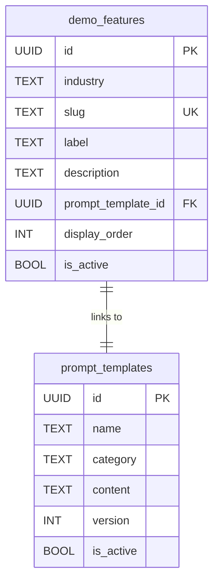

# Scenarios & Architecture

A demo playbook is composed of two types of configurable elements: **architecture features** (structural capabilities) and **scenarios** (personalization use cases). Together, they define what the generated demo application can do.

## Architecture Features

Architecture features are optional structural components toggled in [Builder Wizard Step 2](/guides/builder-wizard). They add foundational capabilities that scenarios may depend on.

| Feature | Default | Description |
|---------|---------|-------------|
| **SE Sidebar** | On | Real-time event stream debug panel showing every Segment call as it happens |
| **Seeded Profiles** | On | Pre-populated mock users (`mockData.ts` + seed script) for realistic demos |
| **Profile API** | Off | Server-side utility for fetching real-time traits from Segment's Profile API |
| **Intent Predictions** | Off | Reads Segment Predictions scores (requires Profile API) |
| **Second-Page Personalization** | Off | SessionStorage-based category detection for cross-page personalization |

<Info>
  **Dependencies**: Intent Predictions requires Profile API to be enabled. The wizard enforces this constraint. Second-Page Personalization is standalone and auto-enabled when the corresponding scenario is selected.
</Info>

## Scenarios

Scenarios are industry-specific personalization use cases. Each scenario is a database-driven prompt template that generates a complete, working feature in the demo app.

### By Industry

<Tabs>
  <Tab title="E-commerce / Retail">
    | Scenario | Description |
    |----------|-------------|
    | **Second-Page Personalization** | Hero banner changes based on the last `Product Viewed` event category |
    | **Authenticated VIP State** | Shipping becomes free when a user is `identify`'d with `vip: true` |
    | **Cart Abandonment Recovery** | Push notification simulation after 30 seconds of cart inactivity |
  </Tab>
  <Tab title="B2B SaaS">
    | Scenario | Description |
    |----------|-------------|
    | **Intent Prediction Upsell** | "Talk to Sales" modal for users with high prediction scores |
    | **Group-Level Context** | Admin tabs appear only when `group()` registers an Enterprise tier |
  </Tab>
  <Tab title="FinTech">
    | Scenario | Description |
    |----------|-------------|
    | **Edge-based PII Masking** | Client-side analytics middleware scrubs SSN/credit card fields before they reach Segment |
    | **Risk Profile Gating** | Loan products gated by real-time credit score traits from Profile API |
  </Tab>
  <Tab title="Media & Entertainment">
    | Scenario | Description |
    |----------|-------------|
    | **Content Affinity Engine** | Homepage categories reorder based on computed viewing affinity scores |
    | **Paywall Thresholds** | Subscription paywall triggers after 3 anonymous article views |
  </Tab>
</Tabs>

## How Scenarios Work

### Database Model

Scenarios are stored across two linked tables:

- **`demo_features`** — Defines which scenarios appear in the wizard for each industry. Contains the slug, label, description, and display order.
- **`prompt_templates`** — Contains the actual prompt text with `{{VARIABLE}}` placeholders. Category is always `scenario` for these entries.

### Selection → Compilation Flow

1. **Wizard Step 3** fetches active `demo_features` for the selected industry
2. User selects one or more scenarios (stored as feature UUIDs)
3. At compilation time, the compiler joins `demo_features` with `prompt_templates` to get the template content
4. The template engine substitutes `{{VARIABLE}}` placeholders with values from the wizard
5. Scenario prompts are appended after the foundation prompts with sequential step numbers

### Demo Script Integration

Each scenario has a corresponding click-path entry in the demo script generator. When the SE Demo Script is generated, it includes:

- A numbered click path (the exact steps to walk through during a presentation)
- An **"Aha!" moment** — the key visual proof point that demonstrates the Segment integration

See the full [Scenario Catalog](/reference/templates/scenario-catalog) for detailed click paths and "Aha!" moments for all 9 scenarios.
