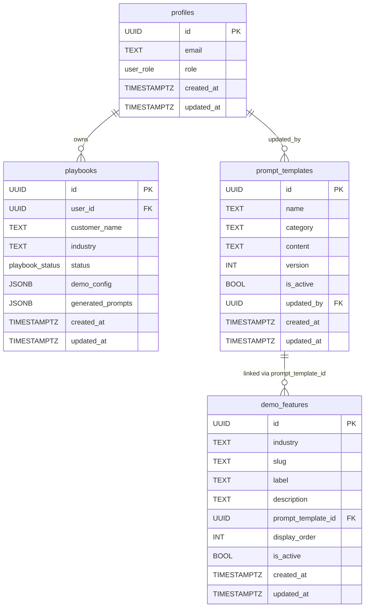

# Database Schema

The Segment Demo Builder uses Supabase (PostgreSQL) with four core tables, two custom enums, and Row Level Security on all tables.

## Entity Relationship Diagram



## Enums

| Enum | Values | Description |
|------|--------|-------------|
| `playbook_status` | `draft`, `completed` | Playbook compilation state |
| `user_role` | `user`, `super_admin` | Access control role |

## Tables

### profiles

1:1 mapping with `auth.users`. Created automatically by a trigger when a user signs up.

| Column | Type | Constraints | Default | Description |
|--------|------|-------------|---------|-------------|
| `id` | UUID | PK, FK → `auth.users(id)` ON DELETE CASCADE | — | User ID from Supabase Auth |
| `email` | TEXT | — | — | User's email address |
| `role` | `user_role` | NOT NULL | `'user'` | Access control role |
| `created_at` | TIMESTAMPTZ | NOT NULL | `now()` | Account creation time |
| `updated_at` | TIMESTAMPTZ | NOT NULL | `now()` | Last update time |

### playbooks

Stores demo configurations and compiled prompts.

| Column | Type | Constraints | Default | Description |
|--------|------|-------------|---------|-------------|
| `id` | UUID | PK | `gen_random_uuid()` | Playbook ID |
| `user_id` | UUID | NOT NULL, FK → `profiles(id)` ON DELETE CASCADE | — | Owner |
| `customer_name` | TEXT | — | — | Demo customer name |
| `industry` | TEXT | — | — | Industry vertical |
| `status` | `playbook_status` | NOT NULL | `'draft'` | Compilation state |
| `demo_config` | JSONB | NOT NULL | `'{}'` | Wizard configuration snapshot |
| `generated_prompts` | JSONB | NOT NULL | `'{}'` | Compiled prompt array (sanitized) |
| `created_at` | TIMESTAMPTZ | NOT NULL | `now()` | Creation time |
| `updated_at` | TIMESTAMPTZ | NOT NULL | `now()` | Last update time |

**Indexes:** `idx_playbooks_user_id` on `user_id`

### prompt_templates

Stores prompt template content with versioning.

| Column | Type | Constraints | Default | Description |
|--------|------|-------------|---------|-------------|
| `id` | UUID | PK | `gen_random_uuid()` | Template ID |
| `name` | TEXT | NOT NULL | — | Template name |
| `category` | TEXT | NOT NULL, CHECK IN (`foundation`, `architecture`, `scenario`) | — | Template category |
| `content` | TEXT | NOT NULL | — | Template text with `{{VARIABLE}}` placeholders |
| `version` | INT | NOT NULL | `1` | Version number (incremented on each edit) |
| `is_active` | BOOL | NOT NULL | `true` | Whether this version is the active one |
| `updated_by` | UUID | FK → `profiles(id)` | — | Last editor |
| `created_at` | TIMESTAMPTZ | NOT NULL | `now()` | Creation time |
| `updated_at` | TIMESTAMPTZ | NOT NULL | `now()` | Last update time |

**Indexes:** `idx_prompt_templates_active` on `is_active` WHERE `is_active = true`

### demo_features

Maps industry-specific scenarios to prompt templates.

| Column | Type | Constraints | Default | Description |
|--------|------|-------------|---------|-------------|
| `id` | UUID | PK | `gen_random_uuid()` | Feature ID |
| `industry` | TEXT | NOT NULL | — | Industry vertical |
| `slug` | TEXT | NOT NULL | — | URL-safe identifier (e.g., `cart-abandonment-recovery`) |
| `label` | TEXT | NOT NULL | — | Display name |
| `description` | TEXT | NOT NULL | — | Short description for the wizard |
| `prompt_template_id` | UUID | NOT NULL, FK → `prompt_templates(id)` | — | Linked template |
| `display_order` | INT | NOT NULL | `0` | Sort order in wizard Step 3 |
| `is_active` | BOOL | NOT NULL | `true` | Whether it appears in the wizard |
| `created_at` | TIMESTAMPTZ | NOT NULL | `now()` | Creation time |
| `updated_at` | TIMESTAMPTZ | NOT NULL | `now()` | Last update time |

**Constraints:** `UNIQUE(industry, slug)`

**Indexes:** `idx_demo_features_industry` on `industry` WHERE `is_active = true`

## JSONB Structures

### demo_config

```typescript
interface DemoConfig {
  persona: string;
  architecture: {
    enableSESidebar: boolean;
    enableSeededProfiles: boolean;
    enableProfileAPI: boolean;
    enableIntentPredictions: boolean;
    enableSecondPagePers: boolean;
  };
  selectedScenarios: string[];       // Array of demo_features UUIDs
  scenarioSlugs?: Record<string, string>; // { [featureId]: slug }
}
```

### generated_prompts

```typescript
interface CompiledPrompt {
  stepNumber: number;
  title: string;
  expectedOutput: string;
  promptText: string;
}
// Stored as CompiledPrompt[]
```
