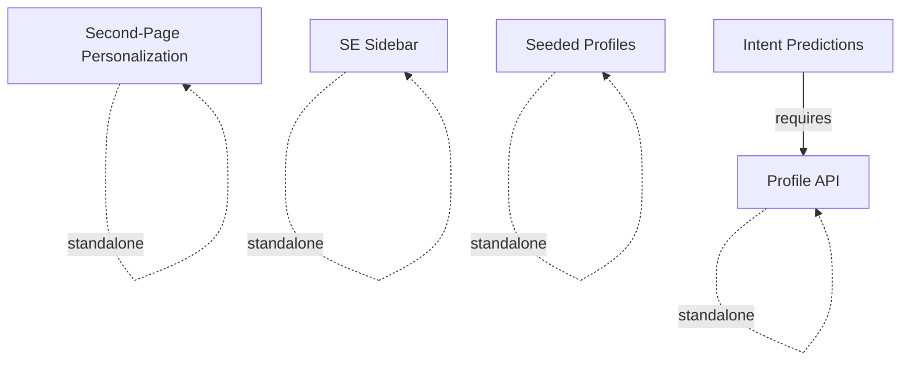

# Architecture Features

Architecture features are structural components toggled in [Builder Wizard Step 2](/guides/builder-wizard). They add foundational capabilities to the demo that scenarios may depend on.

## Feature Reference

| Flag | Default | Requires | Description |
|------|---------|----------|-------------|
| `enableSESidebar` | `true` | — | Real-time event stream debug panel |
| `enableSeededProfiles` | `true` | — | Pre-populated mock user profiles |
| `enableProfileAPI` | `false` | — | Server-side Segment Profile API client |
| `enableIntentPredictions` | `false` | Profile API | Segment Predictions score reader |
| `enableSecondPagePers` | `false` | — | SessionStorage-based category detection |

## What Each Feature Adds

<AccordionGroup>
  <Accordion title="SE Sidebar (enableSESidebar)" defaultOpen>
    **Default:** On

    Injects a collapsible debug panel fixed to the bottom-right corner of the demo app. The sidebar:

    - Listens to all `analytics.track()`, `analytics.identify()`, and `analytics.page()` calls in real-time
    - Displays events as a scrollable feed with timestamps and JSON payloads
    - Provides a toggle button to show/hide during presentations
    - Is essential for demonstrating data flow during live demos

    **Files created:**
    - `src/components/se-sidebar/event-sidebar.tsx` — Main sidebar component
    - `src/components/se-sidebar/event-card.tsx` — Individual event display card
    - Integration into the root layout
  </Accordion>

  <Accordion title="Seeded Profiles (enableSeededProfiles)">
    **Default:** On

    Creates a mock data file and seed script that populates Segment Unify with realistic test users. This ensures the demo has pre-existing user profiles to work with.

    **Files created:**
    - `src/lib/mock-data.ts` — Three realistic user profiles with traits (name, email, plan, VIP status, credit score, etc.)
    - `scripts/seed-profiles.ts` — Script that calls `analytics.identify()` and `analytics.group()` for each mock user

    **Why it matters:** Without seeded profiles, traits like `vip: true` or `credit_score: 750` wouldn't exist in Segment, and scenarios that depend on these traits would fail to demonstrate.
  </Accordion>

  <Accordion title="Profile API (enableProfileAPI)">
    **Default:** Off

    Creates a server-side utility for fetching real-time user traits from Segment's Profile API.

    **Files created:**
    - `src/lib/segment/profile-api.ts` — `getProfileTraits(userId)` function using the Segment Workspace API Token

    **Required credential:** `SEGMENT_PROFILE_TOKEN` (the wizard enforces this when Profile API is enabled)

    **Used by scenarios:**
    - Intent Prediction Upsell (reads `likelihood_to_purchase`)
    - Risk Profile Gating (reads `credit_score`, `risk_level`)
  </Accordion>

  <Accordion title="Intent Predictions (enableIntentPredictions)">
    **Default:** Off

    Creates a utility for reading Segment Predictions scores, which are ML-computed traits attached to user profiles.

    **Files created:**
    - `src/lib/segment/predictions.ts` — `getIntentPredictions(userId)` function that reads prediction scores via the Profile API

    **Dependency:** Requires `enableProfileAPI` to be enabled (the wizard enforces this)

    **Used by scenarios:**
    - Intent Prediction Upsell (triggers upsell modal when `likelihood_to_purchase > 0.7`)
  </Accordion>

  <Accordion title="Second-Page Personalization (enableSecondPagePers)">
    **Default:** Off (auto-enabled when the Second-Page Personalization scenario is selected)

    Adds sessionStorage-based category tracking that persists the user's last viewed product category across page navigations.

    **What it enables:** Cross-page personalization where the homepage hero banner adapts based on browsing behavior within the same session.

    **Used by scenarios:**
    - Second-Page Personalization (reads `last_viewed_category` from sessionStorage)
  </Accordion>
</AccordionGroup>

## Dependencies

The only hard dependency is that **Intent Predictions requires Profile API**. All other features are independent of each other.
