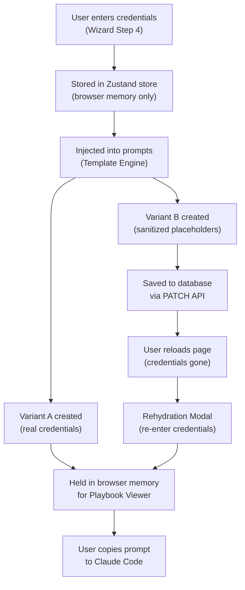

# Credential Lifecycle

This page traces the complete lifecycle of API credentials from the moment they're entered to their eventual use in Claude Code prompts.

## Flow Diagram



## Stage-by-Stage

### 1. Entry (Wizard Step 4)

The user pastes 6 credential values into masked input fields:

| Field | Example Format |
|-------|---------------|
| Segment Write Key (Frontend) | `wk_abc123def456...` |
| Segment Write Key (Backend) | `wk_xyz789ghi012...` |
| Segment Workspace API Token | `tok_workspace_...` |
| Segment Profile API Token | `tok_profile_...` |
| Supabase URL | `https://abc.supabase.co` |
| Supabase Anon Key | `eyJhbGciOiJIUzI1NiIs...` |

### 2. In-Memory Storage

Credentials are stored in the Zustand `BuilderState.keys` object. The persistence middleware **explicitly excludes** the `keys` field:

```typescript
partialize: (state) => ({
  currentStep: state.currentStep,
  customerName: state.customerName,
  // ... other fields ...
  // keys is intentionally excluded
}),
```

This means credentials are lost on page refresh, tab close, or browser restart.

### 3. Compilation

The Template Engine builds a context object from the wizard state. For credentials, the `keyOrPlaceholder()` function is used:

- If a credential has a value → use the real value
- If a credential is empty → use the `YOUR_*` placeholder

### 4. Dual-Variant Split

After compilation, two copies exist:

| Variant | Contents | Destination |
|---------|----------|-------------|
| **A** | Real credentials embedded | Browser memory (Zustand) |
| **B** | `YOUR_*` placeholders | Database (JSONB column) |

### 5. Sanitization

The sanitizer deep-clones all prompts and performs global string replacement:

```typescript
for (const [keyField, placeholder] of Object.entries(SANITIZATION_MAP)) {
  const realValue = keys[keyField];
  if (realValue) {
    sanitized = sanitized.replaceAll(realValue, placeholder);
  }
}
```

The sanitization map:

| Key Field | Replacement |
|-----------|-------------|
| `segmentWriteFrontend` | `YOUR_SEGMENT_WRITE_KEY` |
| `segmentWriteBackend` | `YOUR_SEGMENT_BACKEND_WRITE_KEY` |
| `segmentWorkspace` | `YOUR_SEGMENT_WORKSPACE_TOKEN` |
| `segmentProfileToken` | `YOUR_SEGMENT_PROFILE_TOKEN` |
| `supabaseUrl` | `YOUR_SUPABASE_URL` |
| `supabaseAnon` | `YOUR_SUPABASE_ANON_KEY` |

### 6. Database Storage

Only Variant B (sanitized) is sent to the database via `PATCH /api/playbooks/[id]`. The database never contains real credential values.

### 7. Rehydration

When the playbook is reopened later, the viewer detects placeholders and offers the Rehydration Modal. The user re-enters their credentials, and an in-memory replacement restores the prompts to their real-credential state.

<Warning>
  Rehydration is a client-side operation. Rehydrated credentials are never sent back to the database. Every page reload requires re-entering credentials if you need the real values.
</Warning>

## What Credentials Are NOT

- **Not encrypted** — They're simply excluded from persistence. There's no encryption layer because they're never stored.
- **Not transmitted to third parties** — Credentials are used only in the prompt text that the user manually copies.
- **Not logged** — Analytics events never include credential values. The `fields_provided_count` is tracked, not the values themselves.
